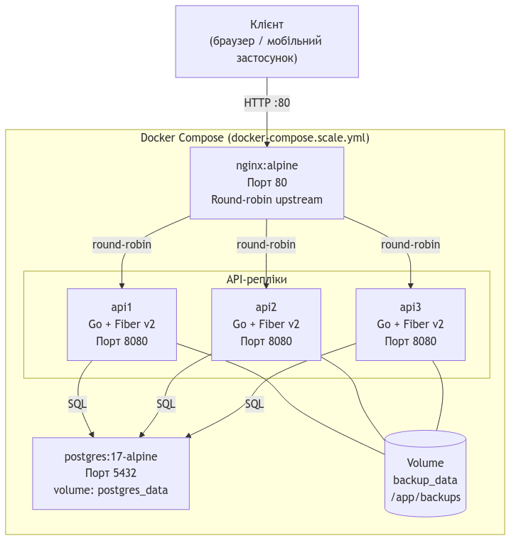

<!-- _class: title -->

# BusOptima

## Система моніторингу завантаженості та динамічного ціноутворення для міжміських автобусних перевезень

Осиченко Ілля Олександрович · ПЗПІ-23-3

---

# Зміст

1. Проблема та рішення
2. Загальна архітектура системи
3. Мобільний застосунок Android
4. Веб-консоль диспетчера
5. Серверна частина: масштабування та резервування
6. Навантажувальне тестування
7. Рольова модель
8. Реалізовано та заплановано
9. Підсумок

---

# Проблема та рішення

**Проблема.** Диспетчер міжміського перевізника не має зручного інструменту для відстеження завантаженості рейсів у реальному часі, прогнозування попиту та автоматичного коригування ціни квитків залежно від заповненості.

**Рішення — BusOptima:**

- IoT-клієнт на ESP32 підраховує пасажирів через інфрачервоні датчики та надсилає події на сервер
- Серверна частина обробляє події, прогнозує попит і розраховує рекомендовану ціну
- Android-застосунок надає водієві та виїзному диспетчеру оперативний доступ до даних рейсу
- Веб-консоль дає диспетчеру та адміністратору повний огляд системи

---

# Загальна архітектура системи

> UML-діаграма розгортання: IoT-клієнт, Android, Веб-консоль → Nginx → 3 репліки Go/Fiber → PostgreSQL

---

# Мобільний застосунок Android

**Стек:** Kotlin · Jetpack Compose · Hilt · Retrofit / OkHttp · DataStore · Navigation Compose

**Ключові екрани:** список рейсів з фільтрацією → деталі рейсу → зміна статусу → рекомендована ціна → аналітика → профіль

**Архітектурні рішення:**
- Шаровий поділ: UI → ViewModel (StateFlow) → Repository → REST API
- JWT-токен додається централізовано через `AuthInterceptor`
- Офлайн-сховище обмежено даними сесії (DataStore) — не дублює серверну БД

---

# Мобільний застосунок Android — прецеденти

> UML-діаграма прецедентів мобільного застосунку BusOptima (Водій, Диспетчер)

---

# Веб-консоль диспетчера

**Стек:** React 18 · TypeScript · Vite · TanStack React Query · Leaflet · Recharts · xlsx

**12 екранів для 3 ролей:**

| Роль | Основні функції |
|---|---|
| Диспетчер | Моніторинг рейсів на карті, прогноз попиту, рентабельність, звіти |
| Бізнес-адміністратор | Маршрути, автопарк, користувачі, параметри ціноутворення |
| Технічний адміністратор | Резервні копії, журнали, стан системи, аудит дій |

Інтернаціоналізація: українська та англійська мова, формат дати/часу, порядок сортування

---

# Веб-консоль — компонентна діаграма

> UML-діаграма компонентів BusOptima Web: Shell → Feature-модулі → API-шар → REST API

---

# Серверна частина — масштабування

**Стек:** Go · Fiber · PostgreSQL 17 · Docker Compose · Nginx

**Горизонтальне масштабування:**
- 3 ідентичні репліки `api1`, `api2`, `api3` за Nginx-балансувальником (round-robin)
- Сервер stateless: JWT-автентифікація, без серверних сесій → будь-яка репліка обробляє будь-який запит
- Graceful shutdown: при зупинці контейнера сервер завершує активні запити за 5 с

**Резервне копіювання (патерн Стратегія):**
- Інтерфейс `BackupService` → `pgDumpBackupService` (pg\_dump + AES-256-GCM) або `JsonSnapshotBackupService`
- SQL-дампи зберігаються в спільному Docker-томі `backup_data`, доступному з усіх реплік

---

# UML-діаграма розгортання

> Клієнт → Nginx (порт 80) → api1/api2/api3 → PostgreSQL + backup\_data volume

---

# Навантажувальне тестування (Locust)

500 одночасних користувачів · 50 req/s · 60 секунд

| Конфігурація | RPS | Середній час відповіді | 99-й перцентиль | Помилки |
|---|---|---|---|---|
| 1 репліка (прямий доступ, порт 8080) | 1538 | 2 мс | 51 мс | 0 % |
| 3 репліки + Nginx (порт 80) | 1536 | 2 мс | 31 мс | 0 % |

Пропускна здатність однакова — вузьке місце не в CPU, а в спільному PostgreSQL.
Головна перевага 3 реплік: **висока доступність** та зниження 99-го перцентилю з 51 до 31 мс.

---

# Рольова модель системи

> UML-діаграма варіантів використання: Диспетчер, Бізнес-адміністратор, Технічний адміністратор (system:backup), Водій

---

# Реалізовано та заплановано

| Компонент | Статус |
|---|---|
| Документація системи (Vision & Scope, межі, план ШІ) | Виконано |
| Мобільний застосунок Android (Kotlin / Jetpack Compose) | Виконано |
| Веб-консоль (React / TypeScript), 12 екранів, i18n | Виконано |
| Серверна частина (Go / Fiber, JWT, аналітика, ціноутворення) | Виконано |
| Горизонтальне масштабування (Nginx + 3 репліки) | Виконано |
| Резервне копіювання AES-256-GCM + GDPR-анонімізація | Виконано |
| IoT-клієнт ESP32 (датчики пасажирів, HTTP-синхронізація) | Виконано |
| iOS-клієнт (Swift) | Не реалізовано — відсутні Apple-пристрої |
| ШІ-інтеграція (LSTM, Prophet, RL-агент) | Заплановано в наступних релізах |

---

# Підсумок

BusOptima — завершена система реального часу, яка закриває конкретну прогалину в роботі міжміських перевізників: автоматичний збір даних про завантаженість, розрахунок рекомендованої ціни та доступ до актуальної інформації для всіх ролей одночасно.

З технічного боку система спроектована з урахуванням реальних вимог до надійності: сервер горизонтально масштабується через три stateless-репліки за Nginx, резервні копії шифруються AES-256-GCM, а персональні дані при експорті анонімізуються відповідно до вимог GDPR.

Із дев'яти запланованих компонентів реалізовано сім. iOS-клієнт та ШІ-модуль прогнозування залишаються наступними природними кроками: API для першого вже готове, а система вже накопичує дані, необхідні для навчання моделі.

---

<!-- _class: title -->

# Дякую за увагу
